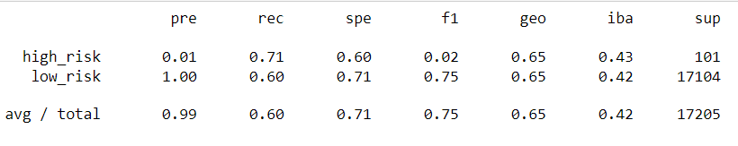
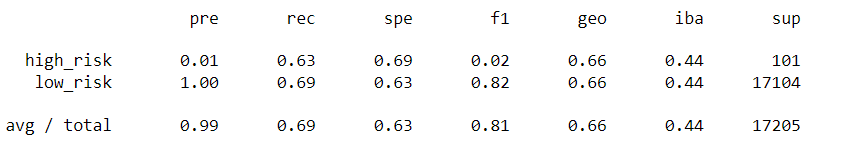
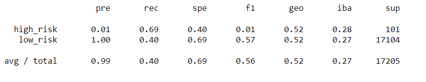
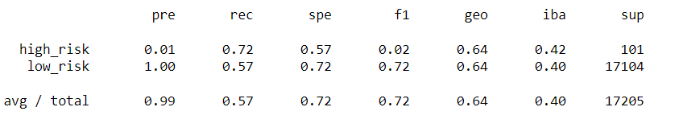
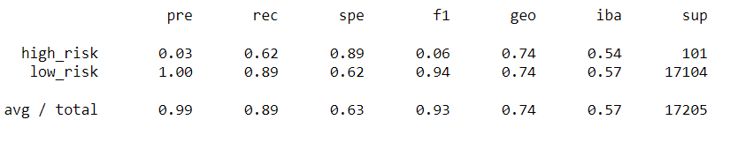
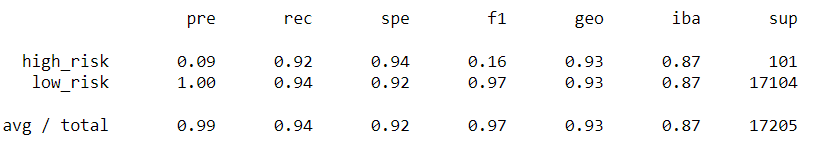

# Credit_Risk_Analysis
## Overview of Project
In Credit Risk Analysis project we are applying the skills data preparation, statistical reasoning and machine learning and employing different techniques to train and evaluate models with unbalanced classes. Finally, performance of this model is evaluated on whether they can predict the credit risk.

## Analysis
## Resampling Models to Predict Credit Risk
### Oversampling
Oversampling model has 99% accuracy but recall is 68, However f1 was 0.81.

### SMOTE algorithm

### ClusterCentroids algorithm
### Undersampling:

For undersampling model recall was least of 40% though precision was around 99%.

### SMOTEENN algorithm to Predict Credit Risk:

### Balanced_Random_Forest_Classifier

### Easy_Ensemble_AdaBoost_Classifier

## Summary:
Utilizing the Easy_Ensemble model was most effective. It provides 99% precision and 94% recall. Though all the models had precision around the same percentage the recall was low for some models with 40-60%. F1 score which is more useful than accuracy is greater with easy ensemble model.

